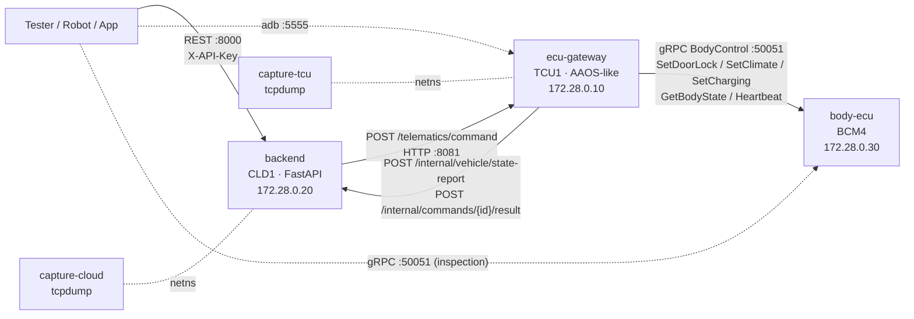

# System Architecture

## 1. Overview

```
                 REST (HTTP/1.1, JSON)                 HTTP/1.1 JSON (telematics)              gRPC (HTTP/2 plaintext)
  Tester/App  ───────────────────────►  backend  ──────────────────────────────►  ecu-gateway  ────────────────────────►  body-ecu
  (you, Robot)   X-API-Key              CLD1                                       TCU1 (AAOS)                            BCM4
                 :8000                  172.28.0.20      ◄────────────────────     172.28.0.10       ◄──────────────────  172.28.0.30
                                                          state reports +           :8081 telematics                        :50051
                                                          command results           :5555 adbd
        ▲                                                                            ▲
        │  adb connect localhost:5555  (shell, pull, logcat, dumpsys)                │
        └────────────────────────────────────────────────────────────────────────────┘

   capture-tcu   : tcpdump in ecu-gateway's network namespace  -> traces/pcap/live/tcu_*.pcap   (sees all three legs*)
   capture-cloud : tcpdump in backend's network namespace      -> traces/pcap/live/cloud_*.pcap
   scenario-runner (on demand, runs inside the gateway namespace) -> traces/pcap/scenarios/<label>/*.pcap
   toolbox (on demand): adb + tshark + Robot Framework on the vehicle network
   * the tester -> backend leg is only visible from the TCU tap when the tester runs in the gateway namespace (scenario runner / toolbox is NOT; the scenario runner is).
```

Mermaid version:



## 2. Containers

| Container | Role in the vehicle system | Tech | Exposed on host | Logs |
|---|---|---|---|---|
| `ecu-gateway` | Telematics/Gateway ECU **TCU-GW-2**, Android Automotive 14 (userdebug). Receives remote commands from the cloud, forwards them to the Body ECU, mirrors the body state into VHAL properties, reports state to the cloud, supervises the Body ECU with a heartbeat. Runs an `adbd` on TCP 5555. | Python (asyncio), aiohttp, grpc.aio; ADB wire protocol implemented in `env/ecu-gateway/adbd.py` | 5555 (adb), 8081 (telematics) | `/data/log/dlt/tcu.dlt` (also `traces/logs/tcu.dlt`), `/data/log/logcat.log` via `logcat` |
| `backend` | Connected Vehicle Backend **CVB_API_1.8.3**, the cloud API used by the app/HMI. Asynchronous command model: accepts, forwards to TCU, learns the outcome from TCU callbacks. | FastAPI + uvicorn, OpenAPI at `/docs` | 8000 | `traces/logs/backend.dlt` |
| `body-ecu` | Body Control Module **BCM-4**: door locks (actuator model with travel time), HVAC (0.5 degC raw signal), on-board charger (SOC model). | grpc.aio server, contract `env/proto/vehicle_ecu.proto` | 50051 | `traces/logs/body_ecu.dlt` |
| `capture-tcu`, `capture-cloud` | Network taps on the backbone and on the cloud link. | tcpdump, rotating every 120 s | - | `traces/pcap/live/` |
| `scenario-runner` (profile `tools`) | Executes scripted end-to-end scenarios while capturing from the gateway namespace. | Python + tcpdump | - | `traces/pcap/scenarios/<label>/` + `run_summary.json` |
| `toolbox` (profile `tools`) | Tester workstation: adb, tshark, Robot Framework, grpcio. | Debian + Python | - | - |

Fixed IPs (`172.28.0.0/24`) are used so that traces are comparable between runs and machines.

## 3. Data flows

### 3.1 Remote command (e.g. `POST /vehicle/lock`)

```
Tester ──POST /vehicle/lock──► backend
backend: create command record (ACCEPTED), request_id = uuid4
backend ──POST /telematics/command {request_id, command:"LOCK"}──► gateway
gateway: journal + queue,  HTTP 200 {result:"QUEUED"}
backend ◄─ 200 ── ; backend ──200 {request_id, status:"ACCEPTED"}──► Tester
gateway worker: command_map[command] -> handler ; gRPC SetDoorLock(request_id, LOCK) with deadline from calibration
body-ecu: actuator travel 250..800 ms ; state change ; CommandAck(OK)
gateway ──POST /internal/commands/{request_id}/result {status, reason, elapsed_ms}──► backend
gateway: GetBodyState ; update VHAL mirror ; POST /internal/vehicle/state-report
Tester ──GET /vehicle/commands/{request_id}──► COMPLETED | FAILED
Tester ──GET /vehicle/status──► last state report
```

### 3.2 Periodic traffic (always present in traces)

* Heartbeat gateway -> body-ecu every 2 s (`Heartbeat`).
* State poll gateway -> body-ecu every 5 s (`GetBodyState`) followed by `POST /internal/vehicle/state-report` to the backend, and after every command.
* Background AAOS chatter in `logcat` (power manager, GNSS, connectivity, audio).

### 3.3 State ownership

| Data | Owner (truth) | Mirrors |
|---|---|---|
| Door lock, HVAC, charging state | body-ecu | gateway VHAL (`/data/vendor/vhal/props.json`), backend last report |
| Command lifecycle | backend record, fed by gateway result callbacks | gateway journal `/data/misc/telematics/command_journal.jsonl` |
| HVAC set point requested by the user | backend | gateway encodes into raw signal for the ECU |
| Calibrations | `/vendor/etc/calibration/tcu_cal.json` (gateway), `/etc/body_ecu/body_cal.json` (body-ecu) | - |

## 4. Files worth knowing on the gateway (via ADB)

| Path | Content |
|---|---|
| `/system/build.prop` | Android build/product properties (`getprop`) |
| `/vendor/etc/calibration/tcu_cal.json` | gateway calibration: command mapping table, gRPC deadlines, HVAC signal encoding, poll periods |
| `/vendor/etc/release_notes.txt` | supplier release notes and known issues |
| `/data/vendor/vhal/props.json` | VHAL property mirror (also `dumpsys vehicle`) |
| `/data/misc/telematics/command_journal.jsonl` | every remote command received, with its outcome |
| `/data/log/dlt/tcu.dlt` | gateway DLT-like log |
| `/data/log/logcat.log` | Android log buffer (use `logcat`) |

## 5. Docker Compose

`docker-compose.yml` defines the project `vehicle-bench`, one bridge network `vehicle-net`
(172.28.0.0/24), five always-on services and two on-demand services under the `tools` profile.
`traces/` is bind-mounted into every container that produces logs or captures, so artefacts appear on
your host immediately. Health checks gate `--wait` on the backend and gateway HTTP endpoints.
